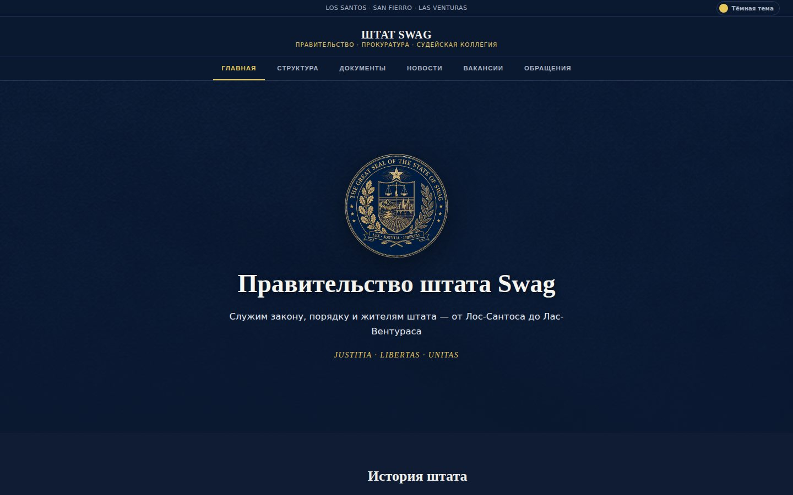
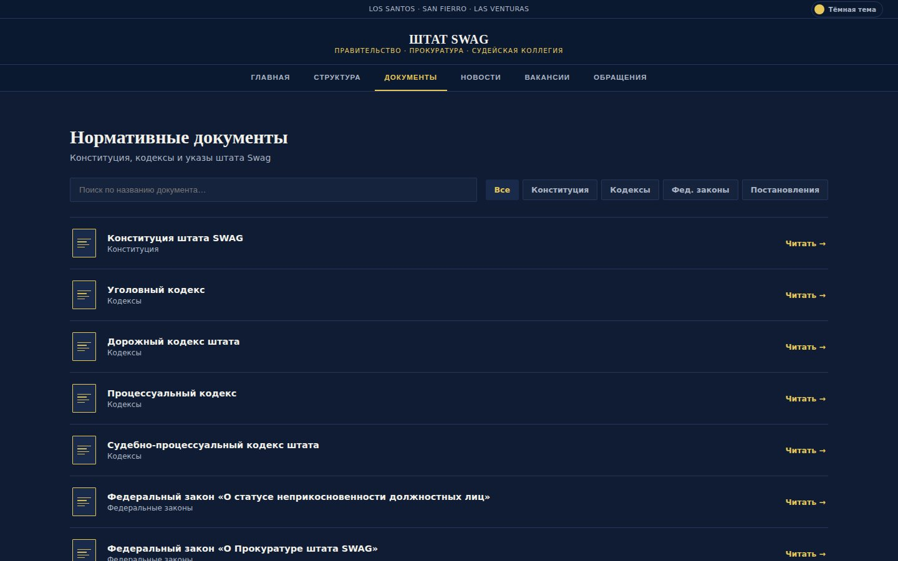
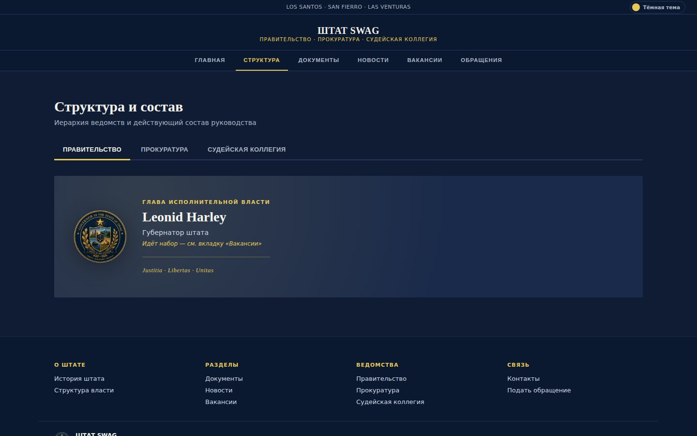
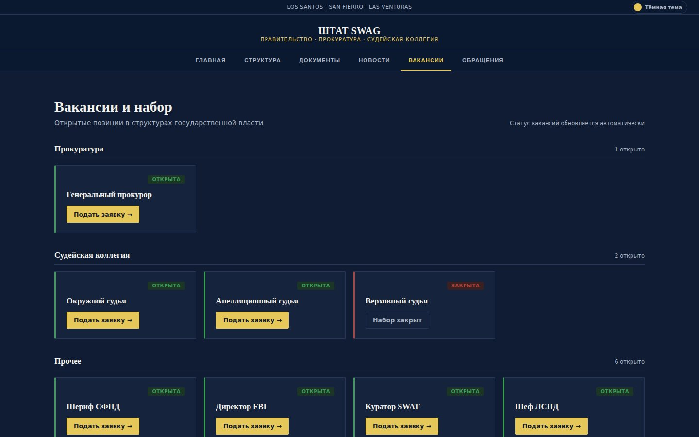
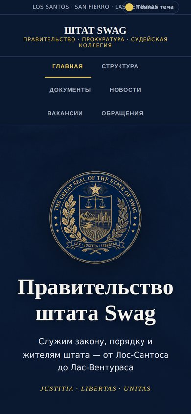

# 🏛 Правительство штата SWAG

**Официальный сайт органов власти RP-штата SWAG** — Правительство, Прокуратура и Судейская коллегия в одном месте: законы, структура, новости, вакансии и приём обращений.

 

---

## О проекте

Сайт для государственной фракции RP-сервера **Arizona RP — SWAG** (GTA San Andreas). Игроки находят здесь всё, что касается власти штата: действующие законы, кто занимает руководящие должности, открытые вакансии и форму обращения. Стилистика — официальный портал госучреждения: тёмно-синий, золото, герб штата.

## Возможности

- 📜 **Нормативные документы.** Конституция, Уголовный, Дорожный и процессуальные кодексы, федеральные законы — с поиском по названию и фильтрами по типу. Тексты хранятся отдельными файлами в `data/`, поэтому их легко обновлять.
- 🏛 **Структура власти.** Три ветви — Правительство, Прокуратура, Судейская коллегия — с руководством и гербами ведомств.
- 📰 **Новости и указы** на главной.
- 💼 **Вакансии.** Открытые и закрытые должности со ссылками на заявления на форуме сервера — берутся из `data/vacancies.json`.
- ✉️ **Обращения граждан.** Форма отправляется через прокси на **Cloudflare Workers**: токены и адреса назначения не лежат в коде страницы.
- 🌗 **Светлая и тёмная тема**, адаптивная вёрстка под телефон.

## Скриншоты

<table>
  <tr>
    <td></td>
    <td></td>
  </tr>
  <tr>
    <td align="center">Документы с поиском и фильтрами</td>
    <td align="center">Структура и состав руководства</td>
  </tr>
  <tr>
    <td></td>
    <td align="center"></td>
  </tr>
  <tr>
    <td align="center">Вакансии со ссылками на форум</td>
    <td align="center">Мобильная версия</td>
  </tr>
</table>

## Как обновлять контент

| Что | Где |
|---|---|
| Тексты законов и кодексов | `data/*.txt` — один файл на документ |
| Вакансии | `data/vacancies.json` — ветвь, должность, статус `open`/`closed`, ссылка |
| Всё остальное | `index.html` |

После пуша в `main` GitHub Pages обновляет сайт автоматически.

## Связанные проекты

- [**swag-vote**](https://github.com/Fegke12/swag-vote) — электронная система голосования Генеральной Ассамблеи и Конгресса этого же штата.

---

Сделано <a href="https://github.com/Fegke12">@Fegke12</a> · проект для RP-сервера, не связан с реальными органами власти

